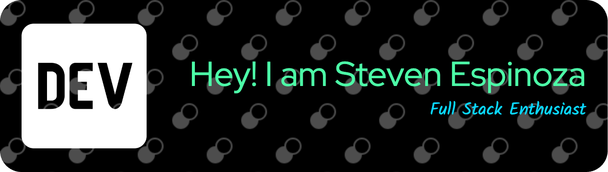

 
   

# 🌐 **About Me**
> Bridging Systems Engineering with Modern Software Development Practices.

I am a seasoned Systems Engineer with over **16 years** of professional experience. I'm actively diversifying my skill set to include modern software development practices. With a robust background in systems integration and a commitment to *data-driven methodologies*, my aspiration is to deliver multifaceted technological solutions that drive team innovation, operational efficiency, and strategic growth.

---

## 📈 **Elevator Pitch**
A versatile Systems Engineer expanding into **software development**. Leveraging a career founded on technical precision and strategic problem-solving, my aim is to offer holistic solutions that bridge system administration, software engineering, and other adjacent technological disciplines.

---

### 🛠️ **Current Endeavors**
I am presently engaged in an intensive full-stack development course with Code Fellows. My focal goal is to transition into a role where I can develop Python-based tools to streamline system integration and team productivity. By March, my plan is to fully apply the skills acquired to transition into a role that enriches technical teams.

---

### 🤝 **Collaboration Ethos**
Rooted in my career is a strong faith in the value of **collaboration**. As I venture into the realm of software development, my aim is to both contribute to and learn from the tech community, thus fostering relationships that enable continuous mutual growth.

---

### 🎓 **Educational Background**
  - **California State University, Fresno**
    - Bachelor's Degree in Computer Information Systems  
  - **Distinguished Honor Graduate, IT Specialist School**
    - Top of my class, focusing on Cisco Network Fundamentals, Routing Protocols, and Security+
  - **Bootcamps**
    - Completed Angela Yu's Web Development Bootcamp
    - Currently enrolled in Code Fellows, focusing on Python, Django, Data Structures, and Algorithms

---

### 🛠️ **Core Competencies**
  - **🔍 Strategic Planning**
    - Specialize in crafting scalable and efficient technology architectures.
  - **📈 Data-Driven Decision Making**
    - Employ large datasets to make well-informed decisions, thereby reducing risk and enhancing project success rates.
  - **🛠️ Troubleshooting Expertise**
    - Notable for promptly diagnosing and resolving a wide array of technological issues.
  - **📚 Team Enablement**
    - Adept at educating and empowering team members, which in turn elevates overall team productivity.

---

📫 **Contact Information*: espisteven5@gmail.com

😄 **Pronouns**: He/His

⚡ **Personal Insight**: Residing in a beach city offers a serene environment that complements my professional activities, fostering a balanced lifestyle conducive to high productivity levels.
---
## 📈 GitHub Metrics  

<!--
## 🌐 Connect with Me  

<h4 align="left">Feel free to reach out on these platforms:</h4>

-->
---

## 🛠️ Languages and Tools  

<h4 align="left">I regularly work with:</h4>

 
 
 
 
 
 
 

 

 

 

