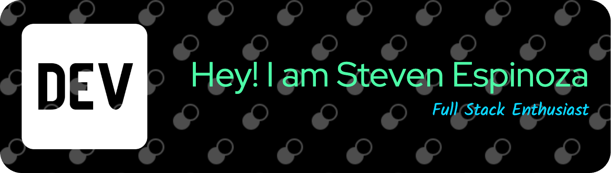

  

<h3 align="center">Senior Systems Engineer · AI Agent Tooling · Edge & Field Operations</h3>

  <a href="https://stevenespinoza.dev">stevenespinoza.dev</a>
  &nbsp;·&nbsp;
  <a href="https://www.linkedin.com/in/stevenespinoza/">LinkedIn</a>
  &nbsp;·&nbsp;
  <a href="mailto:espisteven5@gmail.com">espisteven5@gmail.com</a>

---

### 👋 What I build

Senior systems engineer and Army veteran building AI systems that hold up in the real world — offline-first field tools, guardrails for coding agents, and pipelines that handle messy data in constrained environments. Twelve years across IT, network engineering, and full-stack development.

Everything here is independent side work, built on my own time, MIT licensed.

---

### 🛰️ Field & Edge Operations

Built around the constraint that the network may not be there and the data may not be clean.

| Project | What it proves |
|---|---|
| [`field-sync-notebook`](https://github.com/RedBeret/field-sync-notebook) | Offline-first sync with local queuing and degraded-connectivity recovery |
| [`edge-lab-console`](https://github.com/RedBeret/edge-lab-console) | Full-stack telemetry + config-drift tracking for edge deployments |
| [`telemetry-replay-studio`](https://github.com/RedBeret/telemetry-replay-studio) | Run comparison, outcome scoring, and handoff export for post-mission analysis |

---

### 🤖 AI Agent Tooling

| Project | What it proves |
|---|---|
| [`agent-security-kit`](https://github.com/RedBeret/agent-security-kit) | Guardrails for AI coding agents — secret-leak blocking, dangerous-command hooks |
| [`ollama-model-router`](https://github.com/RedBeret/ollama-model-router) | Automatic model selection by prompt type; no manual switching |
| [`claude-code-recipes`](https://github.com/RedBeret/claude-code-recipes) | Production patterns for the Claude Code SDK: rate limits, memory, MCP, parallelism |
| [`ai-ops-runbook`](https://github.com/RedBeret/ai-ops-runbook) | Paste an alert, get a structured operational runbook — LLM-generated, ops-reviewed |
| [`workspace-search`](https://github.com/RedBeret/workspace-search) | Local-first RAG over personal docs; no cloud, no account required |
| [`awesome-ollama-models`](https://github.com/RedBeret/awesome-ollama-models) | Curated free Ollama-compatible cloud models with benchmarks and use cases |

---

### ⚙️ Automation & Infrastructure Labs

Training environments for automation and infra depth. No real hardware required.

| Project | What it proves |
|---|---|
| [`intent-config-workbench`](https://github.com/RedBeret/intent-config-workbench) | Intent → deterministic config artifacts with reviewable diffs |
| [`ansible-convergence-lab`](https://github.com/RedBeret/ansible-convergence-lab) | Ansible automation training without a control node or real hosts |
| [`ansible-wsl-playbook-runner`](https://github.com/RedBeret/ansible-wsl-playbook-runner) | GUI runner for Ansible playbooks on WSL — bridges the Windows sysadmin gap |
| [`gitlab-ci-study-lab`](https://github.com/RedBeret/gitlab-ci-study-lab) | Hands-on GitLab CI/CD lab with synthetic pipelines |
| [`robot-basics`](https://github.com/RedBeret/robot-basics) / [`robot-intermediate`](https://github.com/RedBeret/robot-intermediate) / [`robot-advanced`](https://github.com/RedBeret/robot-advanced) | Robot Framework training series — 1/3, 2/3, 3/3 |
| [`cli-device-sim`](https://github.com/RedBeret/cli-device-sim) | Network device CLI simulator for automation testing without real gear |
| [`win-netlab-foundation`](https://github.com/RedBeret/win-netlab-foundation) | Windows-first network automation lab — AD, DNS/DHCP, PowerShell baseline |
| [`day0-boot-sim`](https://github.com/RedBeret/day0-boot-sim) | DHCP/TFTP provisioning simulator for day-zero device onboarding |

---

### 🔧 Repo Hygiene Tools

| Project | What it does |
|---|---|
| [`git-clean-history`](https://github.com/RedBeret/git-clean-history) | Removes secrets across full git history — AWS, Azure, GCP, OpenAI, Stripe, GitHub |
| [`repo-first-aid`](https://github.com/RedBeret/repo-first-aid) | Audits public-repo trust signals before strangers find the problems |
| [`repo-flight-deck`](https://github.com/RedBeret/repo-flight-deck) | Repo health dashboard: CI status, security alerts, PR risk scoring |
| [`gh-sentinel`](https://github.com/RedBeret/gh-sentinel) | GitHub activity monitor and alert CLI |

---

### 🛠️ Stack

**Languages:** Python · TypeScript · JavaScript · React · Bash · PowerShell

**AI / ML:** LLMs · edge inference · Ollama · OpenAI · Claude SDK · RAG · prompt engineering

**Cloud / infra:** AWS · Docker · Ansible · GitHub Actions · GitLab CI

**Networking / sysadmin:** Cisco IOS · Active Directory · DNS/DHCP · WSL

**Testing & QA:** Robot Framework · pytest · automated regression pipelines

---

### 🎓 Background

**Certifications** &nbsp;·&nbsp; CSPO · CSM · AWS Cloud Practitioner · CCNA · CompTIA Security+

- B.S. Business Administration, Computer Information Systems — Cal State Fresno
- Software Engineering Certificate (Full-Stack: Python, React, Flask, JS, SQL) — Flatiron School
- IT Specialist (25B MOS), U.S. Army Cyber Center of Excellence — Distinguished Honor Graduate

---

<picture>
  <source media="(prefers-color-scheme: dark)" srcset="https://raw.githubusercontent.com/RedBeret/RedBeret/output/github-contribution-grid-snake-dark.svg" />
  <source media="(prefers-color-scheme: light)" srcset="https://raw.githubusercontent.com/RedBeret/RedBeret/output/github-contribution-grid-snake.svg" />
  
</picture>

  

---

  <em>Find one of these useful? Star the repo. PRs welcome. Open an issue first for anything bigger than a typo fix.</em>

